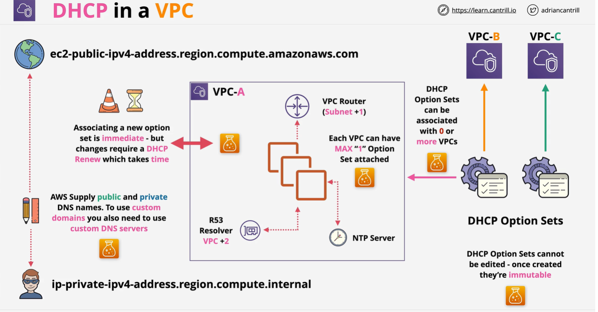
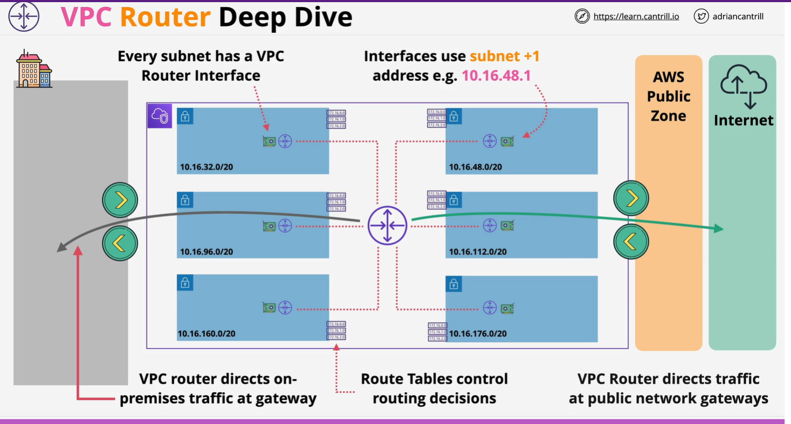
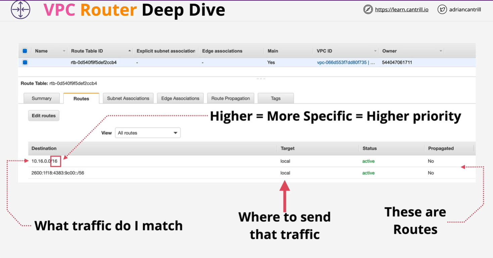
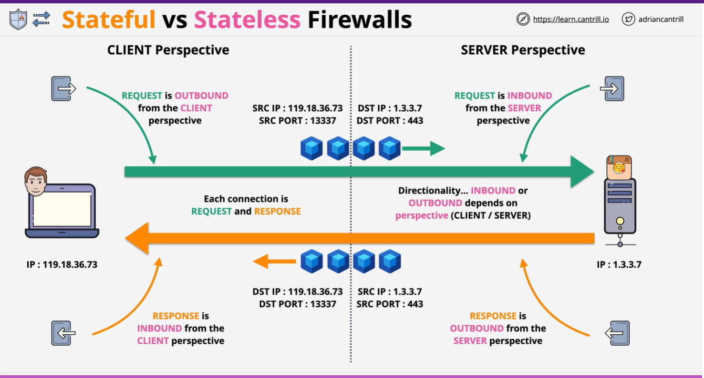
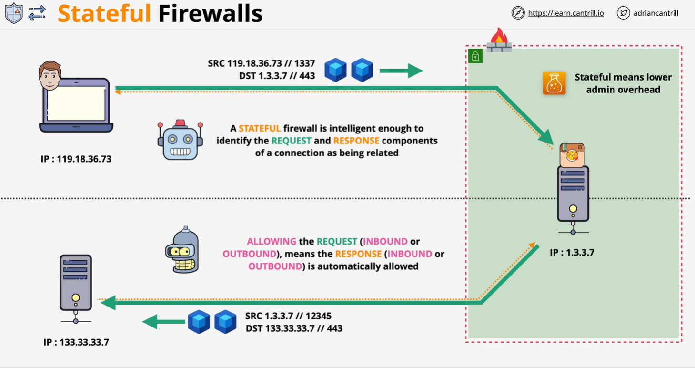
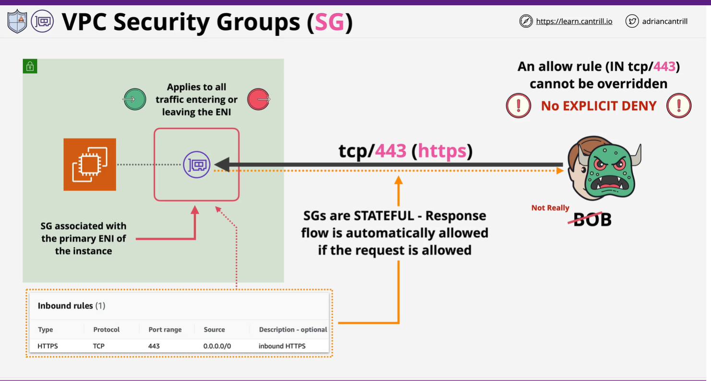
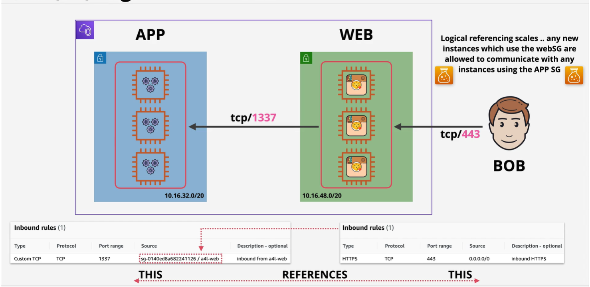
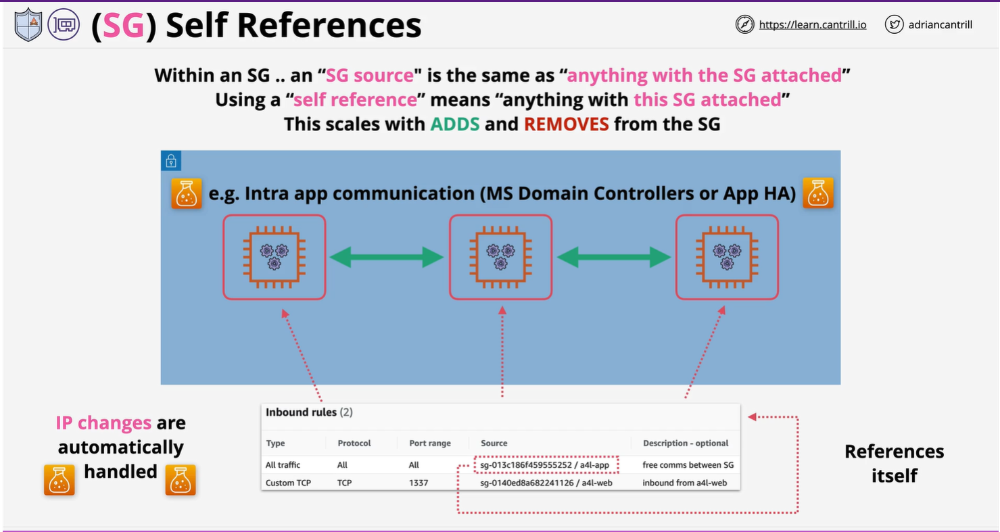

# DHCP

Dynamic Host Configuration Protocol

auto configuration for network resources

starts with L2 broadcast to get info from DHCP server

IP Address, Subnets Masks and Default Gateway

DNS Servers & Domain name

NTP Servers (timezone), NetBios Name server & Node type

## DHCP Options sets
* Are immutable ( Can't be editated once created)
* Can be associated with 0 or more VPCs
* VPC can have max 1 DHCP config set
* Associating a new DHCP option set is immediate
* Changes requires a DHCP renew which takes time -- ** 

VPC Router
(Subnet +1)

NTP Server (Timezone)

AWS Supply public and private DNS names. To use custom domains you also need to use custom DNS servers.

## VPC Router

* Highly available across all the AZs
* Within a VPC
* Scalable = no performance  management is required
* Routes traffic between subnets
* FRom external network into the VPC
* From the VPC to the external network
* Interface in every subnet Subnet + 1 address (default GW via DHCP Option set)
* Controlled using route tables

## Route table

* Every VPC is created with a default route
* Main Route table is default for each subnets withing the VPC
* Custom route tables can be created and associated with subnets in the VPC - removing the main RT.
* Subnets are associated with one route table only ( Main RT or custom RT)
* Routes table contains routes - most specific routes first.
* RT's can be associated with Gateways
* Local route get more priority.

## Satefull vs Stateless Firewall

## NACL
* Stateless
* Only impacts data that is crossing the subnet boundary
* Can Explictly Allow and Denay
* IPs CIRD Ports * Protocols -- No Logical resources
* Can not be assigned to AWS Resources (Only to subnets)
* Use together with Security Groups to add explicit DENY
* Each subnet can have one NACL (Default or custom)
* A NACL can be associated with Many Subnets.

* Default NACL ???

## Security Group

* Statefull
* 
* No explict Deny
* can't block specifc bad actor
* Support IP/CIDR  and logical resource.. including Security group and itself
* Attached to ENI ( not to EC2 instance).
* 

